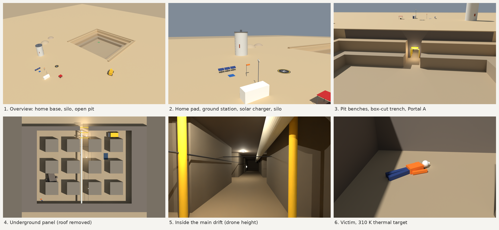

# Drone Simulation: PX4 + ROS 2 + Gazebo + YOLO

A ready-to-run drone simulation that you can set up with **one script** instead of installing every dependency by hand. It includes two missions:

1. **Orbit inspection.** A virtual drone takes off in Gazebo and flies an orbit around inspection targets (a car, a pickup truck and a person). A YOLO model detects those objects live from the drone's camera.
2. **PHOENIX mine search and rescue.** The drone flies into an open-pit phosphate mine and enters an underground tunnel network. It searches the tunnels on its own, finds an injured worker and raises an alert, then flies home and lands.



## What's new

| New | What it gives you |
| --- | --- |
| **`sim.sh` launcher** | One command starts everything in the right order and waits for each part to be ready. Mission shortcuts such as `orbit_start` and `sar_start` are built in. `./sim.sh stop` cleans up everything, including Gazebo. |
| **PHOENIX mine world** (`gazebo/worlds/phoenix_mine.sdf`) | A surface base with a home pad, ground station and solar charger. An open-pit mine with benches and a portal into a dark underground room-and-pillar panel. Rubble, cables, a loader and a victim to find. |
| **Search-and-rescue mission** (`missions/mine_sar_mission.py`) | A fully autonomous flight: take-off, the pit, the tunnel, a room-by-room search, victim detection, marking, then the return home by the shortest explored path and the landing. |
| **Victim alert** | A pop-up window with a beep, a red marker and beacon in Gazebo, a red `tmux` bar, a camera snapshot saved as evidence, and a `/sar/alert` topic. |
| **More reliable start on WSL** | Gazebo starts first and the drone is spawned before PX4 connects to it. Slow world loads no longer make PX4 quit with `gz_bridge failed to start`. |

## Why this repository exists

Running a PX4 + ROS 2 + Gazebo + YOLO simulation normally means following several long guides: ROS 2 Humble, PX4 v1.15, Gazebo, the Micro XRCE-DDS Agent, a Python environment with exact library versions, and a workspace build. One wrong version and nothing works.

The goal of this repo is to make that **reproducible for everyone**:

- **One command to install** everything with the right pinned versions.
- **One command to run** the whole simulation, with every process started in the right order.
- **Works on WSL2**, so Windows users don't need to dual boot.
- **Works with or without an NVIDIA GPU**: YOLO runs on CPU, or on CUDA if available.

It is meant for students, researchers and hobbyists who want to experiment with autonomous drones and computer vision without spending days on setup.

## What the simulation does

```text
                 sensors (IMU, GPS, baro)
   Gazebo  ---------------------------------->  PX4 SITL autopilot
   (world + x500_depth drone)  <------------     (flight brain)
      |            motor commands                    ^
      | camera                                       | Micro XRCE-DDS Agent
      v                                              v
   ROS 2 image bridge                    ROS 2 network (your nodes)
      |  /camera/image_raw              - orbit_controller    (orbit mission)
      +------------------------------>  - mine_sar_mission    (search & rescue)
                                        - mission_monitor     (altitude, speed)
                                        - YOLO detection      (/inspection/detections)
```

- **PX4 v1.15 SITL** flies the drone (software-in-the-loop, no hardware needed).
- **Gazebo** simulates the world, the drone and its camera.
- **ROS 2 Humble** connects everything. Your mission nodes send setpoints to PX4 and read its odometry.
- **YOLOv8** detects objects in the camera stream.
- **MAVSDK keyboard teleop** lets you fly manually.

> Simulation only. This repository is not intended for flying real aircraft.

## Requirements

| Item | Requirement |
| --- | --- |
| OS | Ubuntu **22.04** (native or WSL2) |
| Windows users | Windows 10/11 with **WSL2 + WSLg** (for the Gazebo window) |
| Disk space | about 25 GB free |
| RAM | 16 GB recommended |
| GPU | Optional. NVIDIA GPU with the driver installed on **Windows** (not inside WSL) |
| Internet | Needed during setup (large downloads) |

Ubuntu 24.04 is **not** supported, because ROS 2 Humble targets Ubuntu 22.04.

## Quick start

### 1. Install Ubuntu 22.04 on WSL2 (Windows only)

In Windows PowerShell:

```powershell
wsl --update
wsl --install -d Ubuntu-22.04
```

Open the Ubuntu terminal and create your user.

### 2. Clone the repository

The folder name and location matter. Clone it into your home directory with exactly this name:

```bash
sudo apt update && sudo apt install -y git git-lfs
git clone https://github.com/BigCoder-ops/drone-px4-ros2-yolo-sim.git ~/quard_um6p_intership
cd ~/quard_um6p_intership
git lfs pull
```

### 3. Install everything

```bash
chmod +x scripts/*.sh sim.sh
./scripts/setup_all.sh
sudo apt install -y tmux python3-tk      # used by sim.sh and the victim alert pop-up
```

The script auto-detects an NVIDIA GPU. You can also force a mode:

```bash
./scripts/setup_all.sh --cpu    # CPU-only PyTorch
./scripts/setup_all.sh --gpu    # CUDA PyTorch
```

This takes **1 to 2 hours** (ROS 2, PX4 build, PyTorch). You can safely re-run it if it stops, because finished steps are skipped. Progress is saved in `logs/setup_all.log`.

### 4. Run the simulation

Open a **normal terminal** (not inside an existing `tmux` session), then pick a mission:

```bash
cd ~/quard_um6p_intership

./sim.sh                 # orbit inspection (empty world + car, pickup, person)
./sim.sh --sar           # PHOENIX search & rescue in the mine world
```

`sim.sh` starts everything in this order and waits for each step before the next:

```text
DDS agent -> Gazebo world -> spawn the drone -> PX4 attaches to it -> car/pickup/person
          -> camera bridge -> mission node (orbit, or SAR + monitor)
```

The first start can take 1–2 minutes on WSL, so wait for `[sim] All started`. Everything runs in one `tmux` session, with one tab per part:

| Tab | What it runs |
| --- | --- |
| `control` | Your free terminal, with the mission shortcuts ready |
| `agent` | Micro XRCE-DDS Agent (PX4 <-> ROS 2) |
| `gazebo` | Gazebo server with the selected world |
| `px4` | PX4 SITL, attached to the `x500_depth_0` drone |
| `camera` | Gazebo camera to ROS 2 (`/camera/image_raw`) |
| `orbit` | Orbit mission nodes (with `./sim.sh`) |
| `sar` + `monitor` | Search-and-rescue node + altitude/speed monitor (with `--sar`) |
| `yolo`, `view`, `teleop`, `record` | Optional, see the options below |

To get around:
- Click a tab at the bottom, or press `Ctrl+b` then its number.
- Press `Ctrl+b` then `d` to hide the session; it keeps running. `./sim.sh attach` brings it back.
- **Do not press `Ctrl+C`** in the agent, gazebo, px4, camera or mission tabs, because that stops that part. Type your own commands in `control`, or open a new tab with `Ctrl+b` then `c`.

### 5. Start the mission

In the `control` tab:

| Command | What it does |
| --- | --- |
| `orbit_start` | Start the orbit mission (`./sim.sh`) |
| `orbit_abort` | Abort the orbit and land |
| `sar_start` | Start the search-and-rescue mission (`./sim.sh --sar`) |
| `sar_status` | Follow the SAR mission live |
| `sar_abort` | Fly home now, along the explored path |
| `sar_land` | Land where the drone is |
| `graph` | Open `rqt_graph` (nodes and topics) |

These are shortcuts for the usual ROS 2 calls, for example `ros2 service call /sar/start std_srvs/srv/Trigger "{}"`.

### 6. Stop everything

From a normal terminal (press `Ctrl+b` then `d` first if you are inside the session):

```bash
./sim.sh stop
```

### All `sim.sh` options

| Command | Effect |
| --- | --- |
| `./sim.sh` | Orbit mission, default world |
| `./sim.sh --sar` | Search-and-rescue mission (uses the `phoenix_mine` world automatically) |
| `./sim.sh --world phoenix_mine` | Orbit mission in the mine world |
| `--yolo` | Also start YOLO detection |
| `--view` | Also open the camera image (`rqt_image_view`) |
| `--teleop` | Also open the keyboard-control tab |
| `--record` | Also record a rosbag in `data/bags/` |
| `--all` | yolo + view + teleop + record |
| `--auto-start` | Start the mission automatically when everything is ready |
| `--headless` | No Gazebo window (faster, but no alert markers) |
| `--no-objects` | Do not spawn the car / pickup / person |
| `./sim.sh attach` | Re-open the tabs after closing the terminal |
| `./sim.sh stop` | Stop everything |

The older launcher `./scripts/run_sim.sh` still works for the orbit demo in the default world.

## PHOENIX mine world

`gazebo/worlds/phoenix_mine.sdf` models the PHOENIX scenario: mining inspection and emergency search and rescue in a phosphate mine. It is built only from simple shapes, so it needs no internet or model downloads.

| Place | Gazebo (x, y, z) | PX4 local (N, E, D) | Notes |
| --- | --- | --- | --- |
| Home pad (spawn) | 0, 0, 0 | 0, 0, 0 | Surface plateau, ground station, solar charger, wind sock |
| Inspection silo | 0, 35, 0 | 35, 0, 0 | 14 m tall, 18 m clear around it, rust patches to inspect |
| Open pit | x 50–120, y −35–35 | — | Two 4 m benches, floor at z = −12 |
| Box-cut trench + Portal A | 50–60, 0, −12 | 0, 50, +12 | Tunnel entrance, steel arches, work lights |
| Underground panel | x 14–48, y −22–22 | — | 4 m rooms, 12 pillars, dark on purpose |
| Victim | 16, 20, −12 | 20, 16, +12 | Behind a roof-fall that blocks the direct route |
| Safe landing point | 100, 15, −12 | 15, 100, +12 | Green pad on the pit floor (contingency) |

Gazebo uses ENU (x = east, y = north). PX4 uses NED (x = north, y = east, z = down). The pit floor is 12 m **below** home, so its PX4 z is positive.

Underground hazards include a low cable across the main drift, a ventilation duct, an abandoned loader, a water puddle and the roof-fall. Details, previews and the world generator are in [`docs/phoenix_mine_world/`](docs/phoenix_mine_world/README.md).

## Search-and-rescue mission

```bash
./sim.sh --sar        # then, in the control tab:
sar_start
```

| Phase | What the drone does |
| --- | --- |
| Take-off and transit | Climbs to 15 m and flies about 80 m east to the open pit |
| Entry | Descends to 1.8 m above the pit floor, then flies through the box-cut trench and Portal A |
| Search | Sweeps the underground rooms along a planned route that goes around the roof-fall |
| Detection | Detects the victim with a simulated thermal sensor (within 8 m **and** in line of sight, so pillars block it). If YOLO is running, a `person` detection underground also counts. |
| Mark | Flies over the victim, publishes its position on `/sar/victim` and hovers for 10 s |
| Return | Flies home along the **shortest path through the explored area**, then lands on the home pad |

The victim is usually found 3–4 minutes after `sar_start`, and the whole mission takes about 6 minutes.


### Victim alert

When the victim is found, everything below happens automatically:

| Where | What you see |
| --- | --- |
| Pop-up window | A flashing red **VICTIM DETECTED** window with the position, the sensor, the distance and the mission time. It beeps. Click ACKNOWLEDGE to close it. |
| Gazebo | A red sphere on the victim, a red beacon going up through the rock, and a red ring on the surface above. A green line shows the flown path. |
| `tmux` bar | Turns **red** in every tab, then **green** when the drone has landed |
| `sar` tab | A large red banner and a terminal bell |
| Snapshot | `data/sar/victim_<date>_<time>.png`, the camera image at detection with a caption |
| ROS 2 | `/sar/alert` (latched `String`) and `/sar/victim` (`PointStamped`, PX4 NED) |


### Mission options

To run the node by hand with options (PX4, Gazebo and the agent already running, with a sourced terminal):

```bash
python3 -u missions/mine_sar_mission.py --ros-args -p on_found:=hover    # stay over the victim
python3 -u missions/mine_sar_mission.py --ros-args -p on_found:=land     # land 2 m from the victim
python3 -u missions/mine_sar_mission.py --ros-args -p speed_tunnel:=0.8 -p thermal_range:=6.0
```

| Parameter | Default | Meaning |
| --- | --- | --- |
| `on_found` | `return` | `return`, `hover` or `land` after marking the victim |
| `thermal_range` | 8.0 | Detection range in metres (line of sight required) |
| `speed_tunnel` / `speed_surface` | 1.2 / 4.0 | Flight speeds in m/s |
| `cruise_alt` / `tunnel_height` | 15.0 / 1.8 | Surface altitude, and height above the floor in the tunnel (m) |
| `hover_time` | 10.0 | Seconds spent over the victim |
| `alert_popup`, `gazebo_markers` | true | Turn parts of the alert on or off |
| `use_yolo`, `detections_topic` | true, `/inspection/detections` | YOLO as a second detector |
| `auto_start` | false | Start without calling `/sar/start` |

More details: [`docs/sar_mission/README.md`](docs/sar_mission/README.md).

## Useful commands

```bash
# View the camera
ros2 run rqt_image_view rqt_image_view /camera/image_raw

# Check the camera rate
ros2 topic hz /camera/image_raw

# Follow the SAR mission / see the alert
ros2 topic echo /sar/status
ros2 topic echo /sar/alert

# Record an experiment (or start with ./sim.sh --record)
mkdir -p data/bags
ros2 bag record -o data/bags/run_01 \
  /camera/image_raw /inspection/debug_image /inspection/detections \
  /fmu/out/vehicle_odometry /fmu/out/vehicle_status /fmu/in/trajectory_setpoint
```

In a terminal you opened yourself, load the project first: `source config/project.env && source /opt/ros/humble/setup.bash`. The project uses `ROS_DOMAIN_ID=23`, so without it `ros2` cannot see the nodes.

## Manual flight with the keyboard

The easiest way is `./sim.sh --teleop` (or `--all`), which opens a `teleop` tab. To start it by hand:

```bash
source ~/px4-venv/bin/activate
cd ~/quard_um6p_intership/tools/mavsdk_teleop
python -u keyboard_mavsdk_control.py
```

A small window opens. **Click on it**, because the keys are read from that window.

| Key | Action |
| --- | --- |
| `r` | Arm |
| `l` | Land |
| `w` / `s` | Throttle up / down |
| `a` / `d` | Yaw left / right |
| Arrow keys | Roll / pitch |
| `i` | Print flight mode |
| `Ctrl+C` | Quit |

Do not use the keyboard while the orbit or SAR mission is flying, because they fight for control. Abort the mission first. In the mine world the drone starts facing east, so forward (↑) flies toward the pit.

## Repository layout

```text
quard_um6p_intership/
├── sim.sh               # one-command launcher: orbit or SAR mission, any world
├── config/              # project paths and pinned commits (PX4, px4_msgs, DDS Agent)
├── gazebo/
│   ├── worlds/          # phoenix_mine.sdf (PHOENIX mine), legacy_inspection.sdf
│   └── models/          # inspection models (car, pickup, person, ...)
├── missions/            # mine_sar_mission.py - PHOENIX search-and-rescue node
├── models/yolo/         # YOLO weights
├── perception/yolo/     # YOLO camera detection node
├── ros2_ws/src/         # px4_orbit_inspection package (px4_msgs is downloaded)
├── tools/mavsdk_teleop/ # keyboard flight control
├── docs/
│   ├── phoenix_mine_world/  # world README, previews, make_world.py (world generator)
│   └── sar_mission/         # mission README, route figure, alert preview
├── scripts/
│   ├── setup_all.sh     # one-command installer
│   ├── run_sim.sh       # older launcher (orbit demo)
│   ├── spawn_objects.sh # adds objects to the Gazebo world
│   └── 02_download_sources.sh  # clones PX4 / px4_msgs / DDS Agent at pinned commits
└── installation_guide/  # detailed step-by-step guides (Phase 0, 1, 2)
```

## What is not stored in this repository

Large or machine-specific parts are recreated by `setup_all.sh`:

| Item | Where it comes from |
| --- | --- |
| PX4-Autopilot, Micro-XRCE-DDS-Agent, `px4_msgs` | Downloaded at pinned commits by `02_download_sources.sh` |
| ROS 2, Gazebo, system packages | Installed with `apt` |
| Python environment `~/px4-venv` | Created with pinned versions (NumPy 1.26.4, PyTorch 2.9.1, Ultralytics 8.3.237) |
| `ros2_ws/build`, `install`, `log` | Built with `colcon` |
| `data/bags/`, `data/sar/` | Your recordings and victim snapshots (ignored by git) |

The pinned versions keep the setup reproducible: PX4 `release/1.15` and `px4_msgs` `release/1.15` must match.

## Docker (alternative)

```bash
docker compose up --build                                                  # CPU
TORCH=gpu docker compose -f docker-compose.yml -f docker-compose.gpu.yml up --build   # NVIDIA GPU
```

The image is very large and slow to build. The script-based install above is the recommended path.

## Troubleshooting

| Problem | Fix |
| --- | --- |
| `must live at ~/quard_um6p_intership` | Clone or move the repo to that exact folder |
| No Gazebo window | In Windows PowerShell: `wsl --update`, then `wsl --shutdown`, then reopen Ubuntu |
| Black or very slow Gazebo, no GPU | `export LIBGL_ALWAYS_SOFTWARE=1` before `./sim.sh` |
| `You are inside the simulation tabs` | Press `Ctrl+b` then `d`, then run `./sim.sh` again |
| `gz_bridge failed to start` / `Service call timed out` in the `px4` tab | Happens with `run_sim.sh` when the world loads slowly. Use `./sim.sh`, which spawns the drone first. If the drone is already in Gazebo, run this in the px4 tab: `PX4_GZ_STANDALONE=1 PX4_GZ_WORLD=phoenix_mine PX4_GZ_MODEL_NAME=x500_depth_0 PX4_SYS_AUTOSTART=4002 ./build/px4_sitl_default/bin/px4` |
| `Waiting for PX4 <-> ROS 2 link ... not ready` | The script continues anyway. If `sar_start` answers `no odometry from PX4 yet`, check the `agent` and `px4` tabs |
| `orbit_start: command not found` | The shortcuts exist in the `control` tab. Elsewhere, use the full `ros2 service call ...` command after loading the project (see Useful commands) |
| Mission nodes died with `rcl_shutdown already called` | Someone pressed `Ctrl+C` in the mission tab. Restart that tab's command, and type commands in `control` instead |
| No alert pop-up | `sudo apt install python3-tk`. The other alerts still work without it |
| No red markers in Gazebo | The Gazebo window must be open (do not use `--headless`) |
| `Unable to find file model://hatchback/...` | The car's mesh files are missing. Harmless: the car is not shown, and nothing else is affected |
| ROS 2 commands hang (daemon timeouts) | `ros2 daemon stop && ros2 daemon start` (`sim.sh` does this automatically) |
| `git push`: `No route to host` | WSL lost its network. In PowerShell run `wsl --shutdown`, reopen Ubuntu and push again |
| GitHub API rate limit during setup | Wait a few minutes and re-run `setup_all.sh` |
| `_ARRAY_API not found` (NumPy error) | Never use `sudo pip`. See `installation_guide/README_PHASE1_PX4_AI_VENV_SETUP.md`, section 19 |
| Setup stops with an error | Read the end of `logs/setup_all.log`, fix the cause, and run `setup_all.sh` again |

For deeper details, see the guides in `installation_guide/` and `docs/`.

## Credits

This project is based on the **QUARD UM6P Autonomous Drone Engineering Internship** repository by **abdtnourji**:
https://github.com/abdtnourji/quard_um6p_intership

This repository adds a one-command installer, the `sim.sh` launcher, Docker files, the PHOENIX mine world, the autonomous search-and-rescue mission with victim alerts, and a rewritten README so that anyone can reproduce the simulation. It also builds on these open-source projects: [PX4 Autopilot](https://github.com/PX4/PX4-Autopilot), [ROS 2 Humble](https://docs.ros.org/en/humble/), [Gazebo](https://gazebosim.org/), [Micro XRCE-DDS Agent](https://github.com/eProsima/Micro-XRCE-DDS-Agent) and [Ultralytics YOLO](https://github.com/ultralytics/ultralytics).

Check the original repository for its license terms before reusing or redistributing the code.
