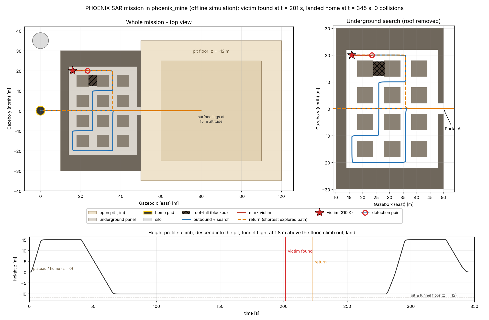
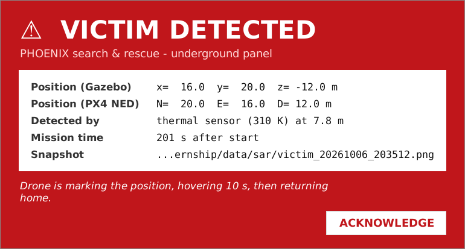

# PHOENIX mine search-and-rescue mission

`missions/mine_sar_mission.py` is a ROS 2 node. It flies the PHOENIX demonstration scenario in the `phoenix_mine` world using PX4 offboard mode. Nothing in PX4 is changed.

1. Take off from the home pad and climb to 15 m.
2. Fly to the open pit and descend to 1.8 m above the pit floor.
3. Go through the box-cut trench and Portal A into the underground panel.
4. Search the room-and-pillar panel along a planned route that avoids the roof-fall.
5. When the victim is detected, fly over it, publish its position on `/sar/victim`, and hover for 10 s.
6. Fly home along the shortest path through the area already explored, then land on the H pad.



## Run it

```bash
sim --sar          # starts PX4 + Gazebo (phoenix_mine) + camera + SAR node + monitor
sar_start          # in the control tab (or any terminal): start the mission
sar_status         # follow it live
sar_abort          # return home now (along the explored path)
sar_land           # land where it is
```

Without `sim.sh`: run `sar_node` in a terminal, wait for `Mine SAR mission ready`, then run `sar_start` in another terminal.

## Victim detection

- **Simulated thermal sensor (default).** The victim (310 K) counts as detected when it is less than `thermal_range` metres away **and** in direct line of sight. Pillars and the roof-fall block the view. This stands in for the thermal camera of the real drone.
- **YOLO (optional).** If your YOLO node is running, any message on `/inspection/detections` that contains `person` also counts as a detection. YOLO messages only count while the drone is underground, so the person near the home pad is ignored.

## Alert when the victim is found

When the victim is detected, the node raises all of these at once:

| Where | What you see |
|---|---|
| **Pop-up window** | A flashing red **VICTIM DETECTED** window with the position (Gazebo + PX4), the sensor used, the distance, the mission time and the snapshot file. It beeps. Click ACKNOWLEDGE to close it. |
| **Gazebo** | A red sphere on the victim, a red beacon going up through the rock, and a red ring on the surface right above the victim. A green line shows where the drone has flown. |
| **tmux tabs** | The status bar at the bottom turns **red** with the message, whichever tab you are on. It turns green when the drone has landed. |
| **sar tab** | A big red banner and a terminal bell. |
| **Camera snapshot** | `data/sar/victim_<date>_<time>.png`, saved with a red caption (evidence for the report). |
| **ROS 2** | `/sar/alert` (std_msgs/String, latched) and `/sar/victim` (PointStamped). |



You can turn some of these off: `-p alert_popup:=false` and `-p gazebo_markers:=false`. The pop-up needs `python3-tk`, which `install.sh` installs for you.

## Options (ROS 2 parameters)

```bash
sar_node --ros-args -p on_found:=hover        # stay over the victim until sar_abort / sar_land
sar_node --ros-args -p on_found:=land         # land 2 m from the victim
sar_node --ros-args -p thermal_range:=5.0 -p speed_tunnel:=0.8 -p hover_time:=20.0
```

| Parameter | Default | Meaning |
|---|---|---|
| `on_found` | `return` | What to do after marking the victim: `return`, `hover` or `land` |
| `thermal_range` | 8.0 | Detection range in metres (with line of sight) |
| `speed_tunnel` / `speed_surface` | 1.2 / 4.0 | Speeds in m/s |
| `cruise_alt` | 15.0 | Altitude for the surface legs (m) |
| `tunnel_height` | 1.8 | Height above the floor in the pit and tunnel (m) |
| `hover_time` | 10.0 | Seconds spent over the victim |
| `min_battery` | 0.25 | Returns home if the battery drops below this. PX4 SITL never drains below 50 %, so this is only for the real drone. |
| `use_yolo`, `detections_topic` | true, `/inspection/detections` | YOLO trigger |
| `auto_start` | false | Start the mission without calling `/sar/start` |

## Tested

- **Offline closed-loop test.** A simulated quad was flown against the real world geometry. The victim was found at t = 201 s and the drone landed home at t = 345 s, with 0 collisions. The abort, `on_found=land` and "victim not found" cases were also tested.
- **Message check.** The ROS node code was run against stub messages generated from the PX4 v1.15 `.msg` files, which checks every field name used.

These tests don't replace a run in real PX4 + Gazebo. If the drone drifts close to a wall, lower `speed_tunnel`.
